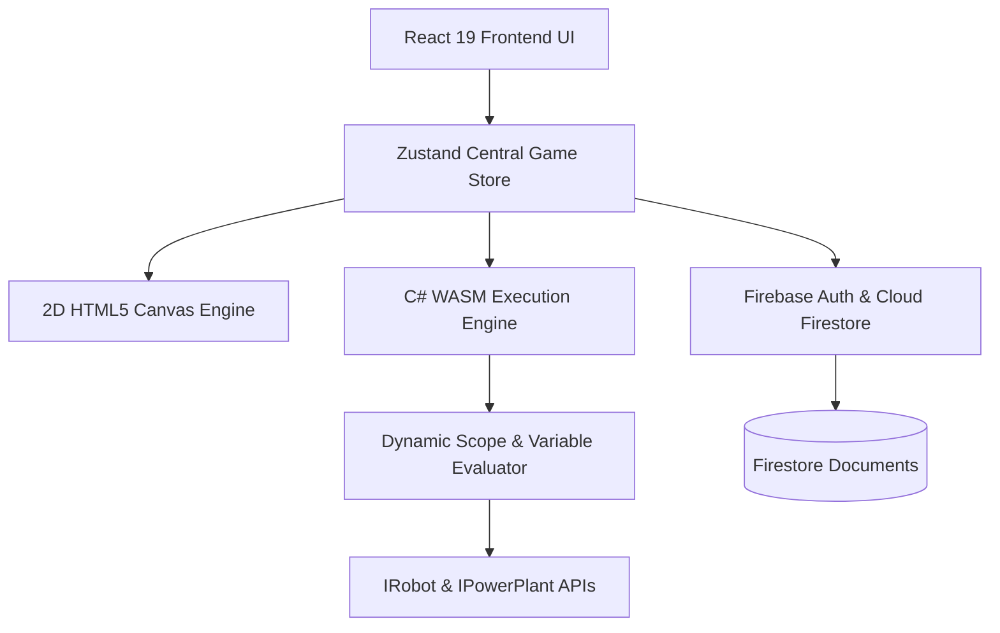
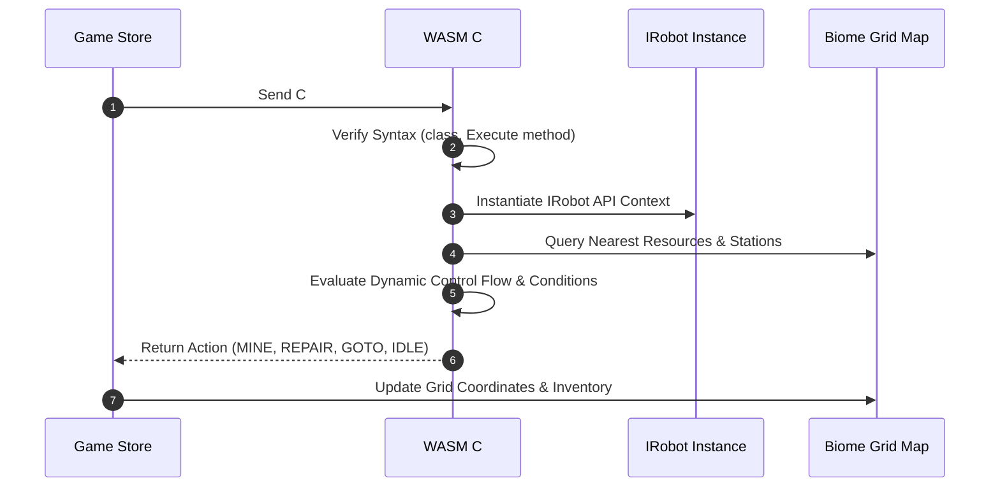

# Syntax Factory

Syntax Factory is a high-performance, real-time autonomous robotics and factory simulation game built with React 19, TypeScript, Vite, Cloud Firestore, and a custom WebAssembly C# Roslyn execution engine. Players program autonomous mining rovers, transporter drones, repair units, and thermal power plants using real C# code, competing on global leaderboards and sharing code in a community marketplace.

Developed by [Berkawaii](https://github.com/Berkawaii).

---

## Technical Architecture Overview

Syntax Factory decoupled simulation architecture runs client-side WebAssembly C# execution alongside a 2D canvas rendering loop at 10 Ticks Per Second (TPS). State persistence is managed through Zustand store with Cloud Firestore real-time synchronization.



---

## C# Script Execution Pipeline

Each simulation tick, the WebAssembly engine evaluates user C# scripts against local biome map state and object positions.



---

## Multi-Biome & Environmental Hazard System

Syntax Factory features four distinct planetary biomes, each presenting unique resource distributions and environmental hazards:

1. Mars Basin Desert: Standard terraforming environment with balanced Iron, Gold, Coal, and Obsidian veins.
2. Volcanic Magma Basin: High-temperature zone featuring lava rivers, Ruby gems, and Volcanic Ash Rain.
3. Quantum Crystal Cavern: Electromagnetic anomaly region containing Quantum Crystal veins and EMP Radiation Waves.
4. Glacial Permafrost Wastes: Sub-zero arctic terrain containing Frozen Ore veins and Polar Blizzards.

---

## Cloud Architecture & State Synchronization Flowchart

```mermaid
flowchart LR
    User[User Authentication] -->|Email / Anon| Auth[Firebase Auth]
    Auth -->|UID| Sync[Firestore Sync Engine]
    Sync -->|Read / Write| Save[users/{userId}/game_data/save_state]
    Sync -->|Check Callsign| Names[display_names/{name}]
    Sync -->|Publish / Download| Market[community_scripts/{scriptId}]
    Sync -->|Post Net-Worth| Ranks[leaderboards/{userId}]
```

---

## Development Roadmap & Engineering Phases

The platform follows an extended 11-phase engineering trajectory:

```mermaid
graph LR
    P1[Phase 01: WASM Engine] --> P2[Phase 02: Swarm Mesh]
    P2 --> P3[Phase 03: Biomes & Power]
    P3 --> P4[Phase 04: Cloud & Market]
    P4 --> P5[Phase 05: Refineries]
    P5 --> P6[Phase 06: R&D Tech Tree]
    P6 --> P7[Phase 07: Exotic Biomes]
    P7 --> P8[Phase 08: Market Crises]
    P8 --> P9[Phase 09: Base Defense]
    P9 --> P10[Phase 10: Custom Assemblies]
    P10 --> P11[Phase 11: AI Copilot]
```



### Phase Details

#### Phase 01: Core WASM Engine & C# Roslyn Runtime (Completed)
- Real-time dynamic C# expression parser and execution bridge.
- Monaco Code Editor integration with syntax highlighting and auto-completion.
- Built-in IRobot API bindings (GetCargo, GetEnergy, GetRadarInfo, GoTo, Mine, Move).
- Multi-threaded 2D canvas rendering engine (20x20 grid simulation at 10 TPS).

#### Phase 02: Swarm Robotics & Wireless Radio Mesh (Completed)
- Specialized Transporter heavy cargo haulers (200kg capacity, 2x movement speed).
- Automated Repair Drones equipped with targeting repair lasers (RepairRobot).
- Inter-robot radio broadcast system (SendRadioMessage, ReadRadioMessages).
- Autonomous swarm mining dispatch and cargo handoff protocols.

#### Phase 03: Multi-Biome Exploration & Power Grids (Completed)
- Thermal Power Plants with dynamic C# overclocking engine (0.5x to 2.0x efficiency).
- Multi-biome support: Mars Basin, Volcanic Magma, Quantum Cavern, Glacial Wastes.
- Environmental hazards: Dust Storms, Ash Rain, EMP Radiation, Polar Blizzards.
- Grid energy buffer storage and station emergency trickle-charging system.

#### Phase 04: Cloud Persistence & Global Script Marketplace (Completed)
- Firebase Auth & Cloud Firestore sync for save states, biomes, and C# scripts.
- Unique Engineer Callsign registry (display_names collection).
- Global Competitions Leaderboard with automated net-worth score calculation.
- Community C# Script Marketplace for sharing and downloading autonomous scripts.

#### Phase 05: Industrial Processing & Refineries (In Progress)
- Multi-tier Smelter & Refinery crafting recipes (Iron Ingots, Gold Bars, Ruby Lenses).
- Storage Silos and automated inventory logistics nodes.
- Automated Mineral Smelters and Processing Refineries.
- Advanced C# IBuilding, ISmelter, and IRefinery control APIs.

#### Phase 06: Corporate HQ & Dual-Resource R&D Lab (Planning)
- Corporate HQ administrative control building and management dashboard.
- R&D Lab Tech Tree requiring both Credits ($) and Processed Products (Ingots, Cores).
- Tech Upgrades: Superconductor Cables (-30% Temp), Nuclear Bits (2x Mining), Biome Shields.
- New Robot Classes: Titan Heavy Excavator, Sky Transporter Flying Drone, Combat Sentinel.

#### Phase 07: Exotic Biomes & Advanced Mining (Planning)
- New Planetary Biomes: Titanium Trenches, Hyperion Orbital Rings, Sub-Crustal Magma Vent.
- Exotic Resources: Titanium Ore, Neodymium Magnets, Helium-3, Antimatter Cells, Diamonds.
- Advanced C# APIs for drone flight altitude control and energy shield status telemetry.

#### Phase 08: Dynamic Market Crises & Volatile Economy (Planning)
- Economic Crises Engine featuring sudden resource shortages and price spikes.
- Crises Events: Quantum Chip Shortage (50x Price), Helium-3 Surge (+500%), Iron Glut (-80%).
- Commodity Market Telemetry displaying price charts and forecast crisis alerts.

#### Phase 09: Automated Base Defense & Rogue Raids (Planning)
- Defensive Turret networks with programmable targeting algorithms (ITurret API).
- Dynamic Rogue Bandit waves and automated defense response protocols.
- Security alarms, perimeter sensors, and automated lockdown modes.
- Repair Drone threat priority dispatching during base attacks.

#### Phase 10: Custom Assemblies & Script Profiler (Planning)
- User-defined C# helper classes and custom namespace imports (using MyCustomLib).
- Multi-file C# workspace management inside integrated Monaco Editor.
- Script version history, diff inspector, and single-click rollback.
- CPU tick execution profiler and memory usage telemetry inspector.

#### Phase 11: AI Copilot Agent & Visual Logic Builder (Future Vision)
- Integrated AI C# Copilot agent for real-time syntax and logic diagnostics.
- Automated code optimizer suggesting vector pathfinding improvements.
- Visual Block-Code bridge for converting C# code to visual node graphs.
- Interstellar resource trade networks and planetary defense satellites.

---

## Installation & Local Development

### Prerequisites
- Node.js 18+
- npm or yarn

### Setup
```bash
git clone https://github.com/Berkawaii/codingTycoonGame.git
cd codingTycoonGame
npm install
npm run dev
```

### Production Build
```bash
npm run build
```

---

## License

MIT License. Designed and developed by [Berkawaii](https://github.com/Berkawaii).
